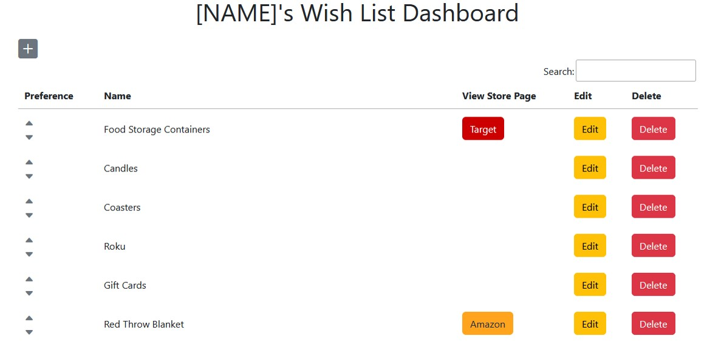

# WishList
A php web application used to update and distribute your wish list. Includes a dashboard page displaying all of your wish-list items, and buttons to add new items, edit or delete existing items, and view the online store page of an item if one has been provided. Also includes an index page which is the link you will give to people who want to view your wish list and claim items from it.

## Technology Stack
This web application is written to run on an apache/mysql/php web server.

## Dependencies
To host this app in its vanilla state, only an apache server with php and a mysql server are required. By default, this app is set up to use a mysql server on the same machine as the apache server, but can easily be made to connect to a mysql server on another machine. All required javascript/css libraries are included in the `src` folder.

## Installation
1. Copy and paste the `src` folder into any public facing directory of your website.
    1. [OPTIONAL] Rename the `src` folder and arrange it in the file system in a way that will be easy and understandable for your users. I put the `src` folder in site.com/wish-list/ and then rename the `src` folder to "stephen", because I keep multiple peoples wish lists on my website, and this way I just give out the link: site.com/wish-list/name to my viewers.
2. In src/dashboard.php, and src/index.php, change the `$pageTitle` variable to have your name instead of "[NAME]".
3. In src/core/database/pdo.php, fill in your db connection info in the `YOUR DB CONNECTION INFO HERE` area.
4. Execute the SQL in the `sql` folder in your SQL server to add the needed tables to your database.

## Features
### 1.0: Dashboard
The dashboard page displays a list of all items currently on your wish list, with buttons for:
-adding items
-viewing the online store page of an item if one is provided
-editing an item
-deleting an item
-changing an items preference order

#### 1.1: Add Item
`+` button on the top left of the dashboard page allows you to add an item (with or without a link to an online store page) to your wish list (newly added items default to last in the preference order). Also includes an 'Add Seller`, to use if the seller you need is not in the seller dropdown.

#### 1.1.1: Add Seller
`+` button to the right of the `Seller` dropdown, allows you to add a seller if the desired seller is not in the dropdown list.

#### 1.2: Edit Item
`Edit` button allows you to make changes to an item's name, link, or seller.

#### 1.3: Delete Item
`Delete` button allows you to remove an item from your wish list.

#### 1.4: Preference
Up and down arrows to the left of each item allow for ordering of the list from most wanted item at the top, to least wanted item at the bottom.

### 2.0: Index Page
The index page contains the list of items on your wish list, a button to view the online store page of an item if one is provided, and a button to mark an item as claimed. Also indicates the list is displayed with the most wanted item at the top, and least wanted at the bottom. This will be the page you provide to people who you wish to view your wish list. **YOU SHOULD NOT VIEW THIS PAGE if you don't want to know what people are getting for you, as it will show strikethroughs on items that people have claimed.**

#### 2.1: Claim Button
If a user wants to mark an item as claimed, so other people will know not to get it, they can use the claim button marked "I'll Get This" which will change the name of the item to strikethrough text, and remove the claim button

### 3.1: View Store Page Button
Index and Dashboard have a View Store Page button if a link and seller are provided marked with the name of the seller that opens the link in a new tab.

### ~~3.2: Searchable Sortable Lists~~ (Partially removed in v2.1.4 | See feature 3.4)
~~Index and Dashboard both have the ability to sort or filter items by name or seller.~~

### 3.3: Mobile Friendly
All pages are made to behave on all screen sizes.

### 3.4: Searchable Lists
Index and Dashboard both have the ability to filter items by name or seller.

## Contributions
Please feel free to fork this repo and submit pull requests with changes. I will review pull requests case-by-case and if I decide I want to implement your change, I will merge it for you! Otherwise feel free to copy this repo and re-distribute!
